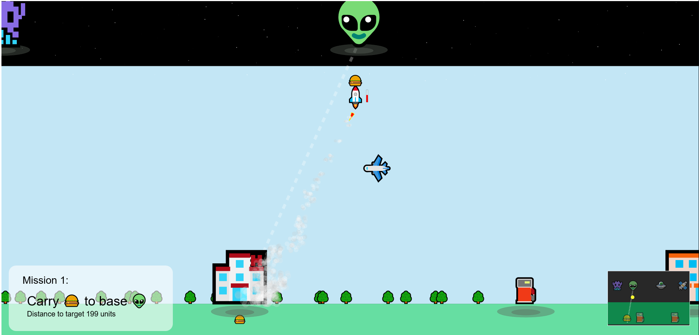

  
   
<a href="https://js13kgames.com/entries/rocket-cargo" target="_blank"><b>Play the game</b></a>
 

   

  
  <b>Rocket Cargo</b> is an order delivery game with a rocket.

  Inspired by the famous SpaceX first prototype for Mars: <a href="https://www.spacex.com/vehicles/starship/" target="_blank"><b>Starhopper</b></a>

  <h2>Basic operation</h2>
   
- Press F to refuel the Rocket at fuel pump
   
- Press W or UP to thrust the rocket
   
- Press A/D or LEFT/RIGHT to move the rocket when flying
   
- Press Q to activate FTS (Flight Termination System) if you run out of fuel
   
   
  <h2>Tips</h2>
   
- Take off when air traffic permits
   
- Be careful not to run out of fuel, refuel at the fuel pump
   
- With each completed mission the air traffic difficulty level is increased.
   
   
   
  All the graphics are emoji to fit the game within <b>13kB</b>, 
   
    as the game was created for the 2021 <a href="https://js13kgames.com" target="_blank"><b>JS13K game competition</b></a>.
   
  

